<!--
pagenumber: 2
title: Images and documents
-->

# Working with images and documents 

## In this section: 

* Learn how to upload one image or multiple images to a site. 
* Learn how to insert images and [other media](working-with-images-and-documents/#embedding-other-media) into the content of a webpage.
* Learn how to [upload PDF](working-with-images-and-documents/#uploading-and-linking-to-documents), .DOC, audio, and video documents and link to them in the content of a webpage.
* Learn how to manage uploaded files.  

## Inserting images 

There are two ways to upload images: on-the-fly, while you're editing a page, or in the 'File Management' Section.

### Uploading single images

The simplest way to insert an image stored on your local hard drive into a webpage is to go to that webpage in the Pages tab, and click the "Insert Images" button on the toolbar in the Editing Pane. (It's the picture of the little tree). This will bring up the insert/edit images pop up.

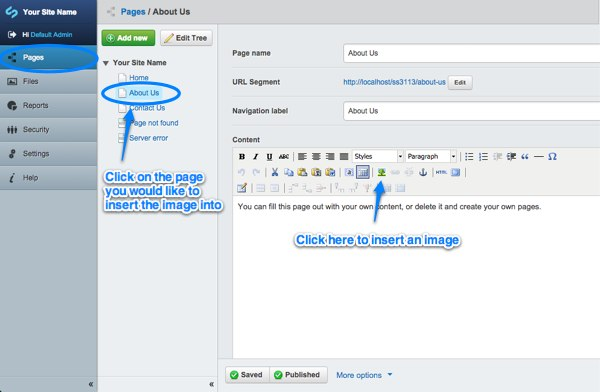 

** Sample Image: **

 

In the Images popup, the "From your computer" tab should be selected as default. Click "Choose files to upload...". You can then upload a file from your hard drive. A progress bar should appear in the "Details & dimensions" section below. 

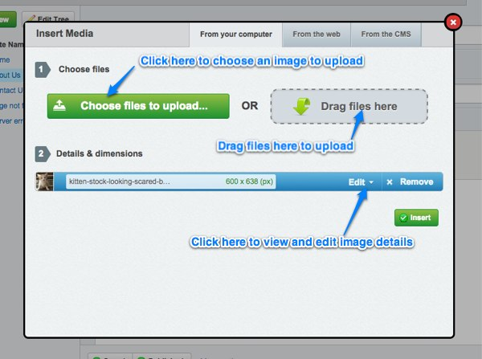 

There is also the option to upload an image from another web page. To do this click on the "From the web" tab in the insert image pop up. Copy the image URL from your browser and paste it into the URL field. Click the green plus icon below the field to add the image. 

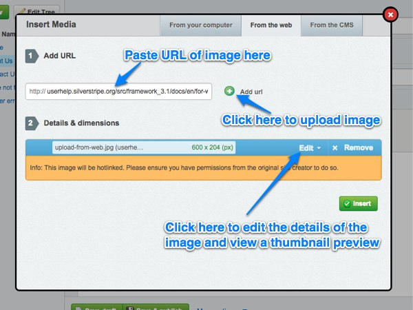 

Once the image is uploaded you will see a small thumbnail on the left of the progress bar as well as the option to edit the images details or remove the image.

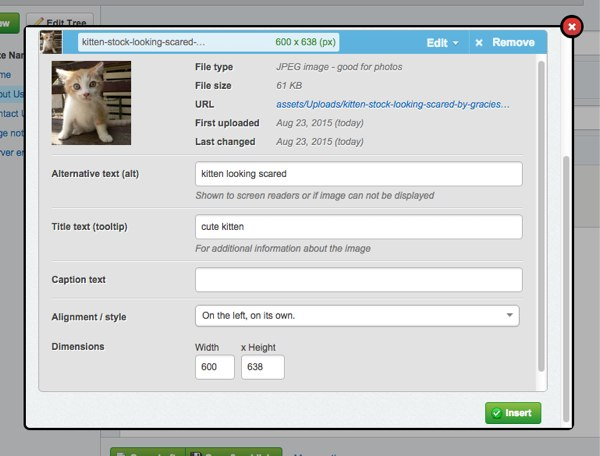 

It is possible to insert mulitple images using the "on-the-fly" method. You can upload them one at a time (clicking the "Choose files to upload..." again once an image has uploaded) or you can select multiple image files by holding "control" (Windows) or "command" (Mac) on the keyboard while clicking the chosen images. This last method is the fastest as all images load simultaneously.

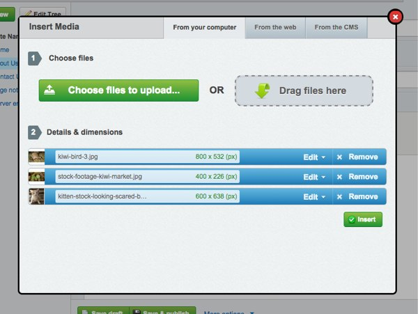 

You can also flick between the "From your computer", "From the web" and "From the CMS" tabs (See [Inserting uploaded images](working-with-images-and-documents/#inserting-uploaded-images) section for more details on this tab), adding images from multiple locations.

Once you have uploaded all the images you need, you can click the "Insert" button in the bottom right of the pane to insert the images into your content.

 

 
### Notes:

Once a photograph has been uploaded, you can re-use it in multiple places in your website. You will want to see "Inserting previously uploaded images" below for details on how to re-use a photograph, and "Managing Files" to organize and maintain image files uploaded to the Website.

 
### Embedding other media

Using the "From the web" tab you can also embed other media into the page content. Many of the [services that support oEmbed](http://oembed.com/#section7) protocol can be handled in this way:

* YouTube
* Flickr
* Vimeo
* Viddler
* Revision3
* Hulu
* Twitter

Let's take as an example embedding of a the ["What's new in SilverStripe 3 in under 100 seconds"](http://vimeo.com/44911918) video from Vimeo.

First of all, insert the "http://vimeo.com/44911918" into the "Add URL" field of the "From the web" and press the "+ Add url" link:

 

You can then tweak the specific options for the given media and press "Insert" to finish the embedding. 

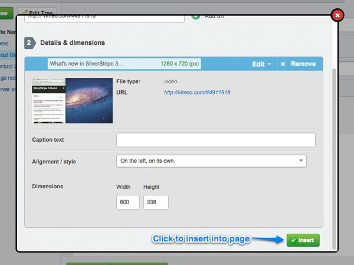 

You can then tweak the options by reselecting the media in the editor and pressing "Insert Media" button again, and then expanding the relevant media details as you would with a regular image.

 

Once you are done press "Insert" to adjust the embedded media.

### Uploading images to the CMS from the Files Menu.

To upload images to the CMS, head to "Files" in the Navigation on the left side of the page. (Be sure to save any page you are working on in the editing page to a draft before doing so, otherwise you may lose any changes you have made since the last save).

You should see a list of all of the files (and folders containing files) that have been uploaded to the CMS, where the Editing pane would normally be.
Before you upload your images/files, create a new folder (See the section below on [Managing Files](working-with-images-and-documents/#managing-files)) to put your images in or click on the folder you would like the images to be uploaded to. To upload a file or image, click on the "Upload" button located above the list of files. This will take you to the upload files pane.

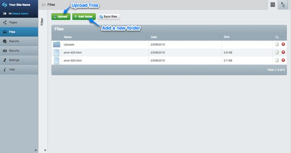 

From the upload files page, click on the "Choose files to upload" button to choose your first file to upload or drag your files into the "Drop Area" (this will automatically start the upload).

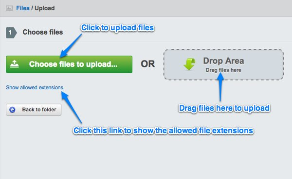 

Repeat this process for every file you wish to upload or you can select multiple images/files to upload by holding "control" (Windows) or "command" (Mac) on the keyboard while clicking your chosen images/files. 

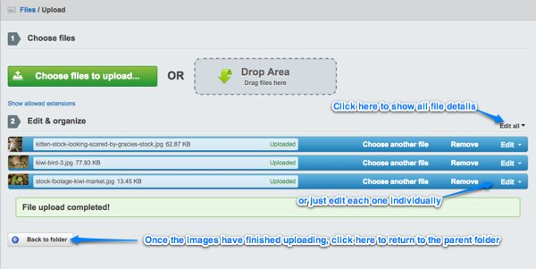 

Once the images have finished uploading, click the "Back to folder" button to go back to the parent folder. You should now see the files you uploaded within your chosen folder.

 
### Notes: 

This same process can be used for filetypes other than images as well, which we will cover in "[Uploading and Linking to Documents](working-with-images-and-documents/#uploading-and-linking-to-documents)." 

### Inserting uploaded images

Once you have uploaded an image, you can insert it into any page.  Make sure the page you want to add the image to is in the Editing Pane, then click on the "Insert Images" button. 

 

This should bring up the insert image pop up. Click on the "From the CMS" tab and you should see a list of files. If you do not see the image you want, it may be in another folder.  You can choose which folder you would like to view by clicking on the "Folder" drop-down box above the list of files. Additionally, you can use the provided search box to search by the image's filename.

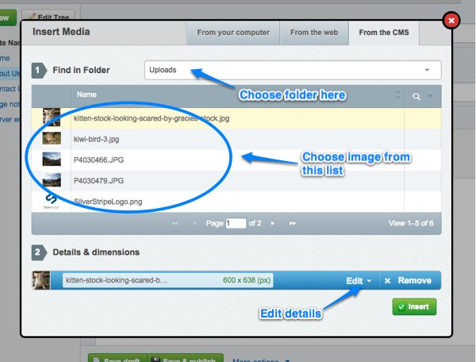 

When you see the image you want, click on the image to select it. You can now edit the details of the image by clicking on the edit button. Here you can then add alternative text, which is shown if the image cannot be displayed (for example, on text-only web browsers, or screen readers for the blind) and title text, which shows additional information about the image when the mouse rolls over the image.  If you wish to add a caption, you can do so.  You can also choose the alignment and text wrapping properties of the image as well as the dimensions of the image to be displayed in the site.  

When you are done entering this information, hit the "Insert" button on the bottom right of the Insert Images popup. This will place the image in your text where your cursor was in the editing pane.  

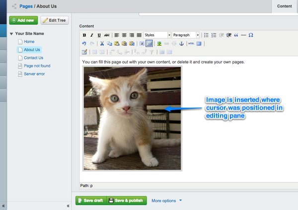 

## Uploading and linking to documents

To upload documents, such as PDF files, Word .DOC documents, and downloadable audio and video files, head to "Files" in the Navigation on the left side of the page. (Be sure to save any page you are working on in the editing page to a draft before doing so, otherwise you may lose any changes you have made since the last save).

Click on the "Upload" button above the list of files in the "Files" pane and follow the instructions from the [Uploading images to the CMS from the Files Menu](working-with-images-and-documents/#uploading-images-to-the-cms-from-the-files-menu) section above the same process applies to all file types.

To link to documents, return to the page you wish to create the link in by clicking on the "Pages" Navigation tab, and choose the page you wish to edit. Highlight the text you would like to make into a hyperlink, and click the "hyperlink" button to bring up the "Insert link" popup.

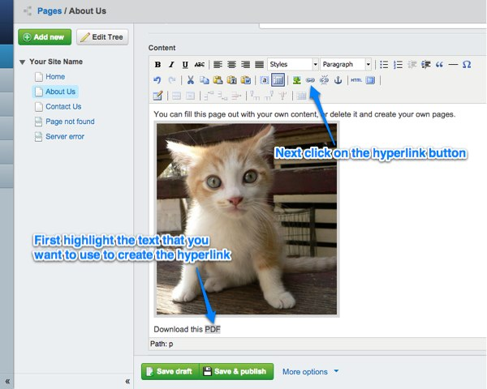 

From the "link to" step (1) choose "Download a file" from the list of options. You may choose the document from the dropdown menu.

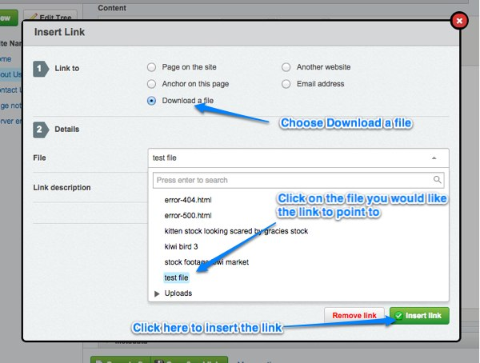 

Finally, to insert the link, click the "Insert link" button at the bottom-right of the popup.

## Managing files

To manage your uploaded files, head to "Files" in the Navigation on the left side of the page. The main CMS pane will now show a list of the directories that hold files in your website.  This includes both images and documents such as PDF files, and can also include javascript files.

## Creating, moving, and deleting folders

You can create new folders to store images and documents by clicking on the "Add folder" button on the top of the Files Pane.  The newly created folder will be placed as a subfolder of whatever folder you currently have selected.

To delete a folder, click on the the delete icon in the actions column to the right of the folder listing. This will bring up a browser dialog box saying "Do you really want to delete this folder and all contained files?" Click yes to delete the folder.

## Searching for images and documents

To search for an image, type the whole or partial filename in the "Search" field in the Filters panel. The filter panel is situated to the left of the Files pane. By default it is closed. To open and close the panel click the arrows at its base.

## Moving, deleting and Renaming images and documents

Locate the file you wish to edit, (you may need to use the search filter if there are a large number of images in the folder). To edit the location or details of a document, click the edit icon in the actions column to the right of the file listing. This will bring up the file details pane. If you wish to delete a file, simply click the delete icon in the actions column to the right of the file listing.

Once you have opened the File details pane, and you can edit the files details and move the file to a new location by choosing a new parent folder from the folder dropdown. Hit "Save" at the bottom left of the pane when you are done editing.

You can also delete the file from here too. To do this click the delete button which is located next to save at the bottom of the pane.

 
### Notes:

By default, uploaded files are placed in the "Uploads" directory.

If you place an image in a webpage, and later move or rename that image in "Files & Images," SilverStripe CMS will automatically keep track of those changes, so your webpage will remain unchanged - you don't even have to republish the page. [Editor's Note: Isn't that awesome?]

